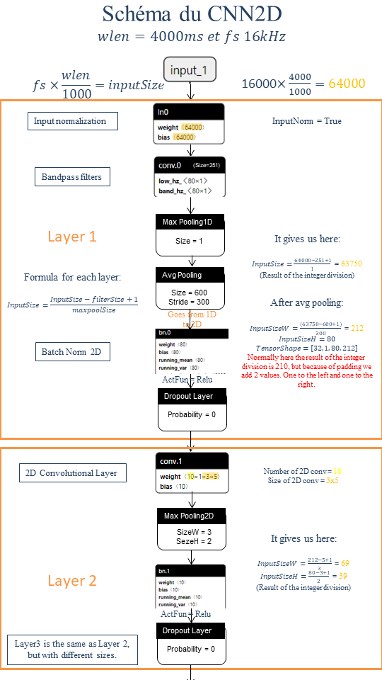
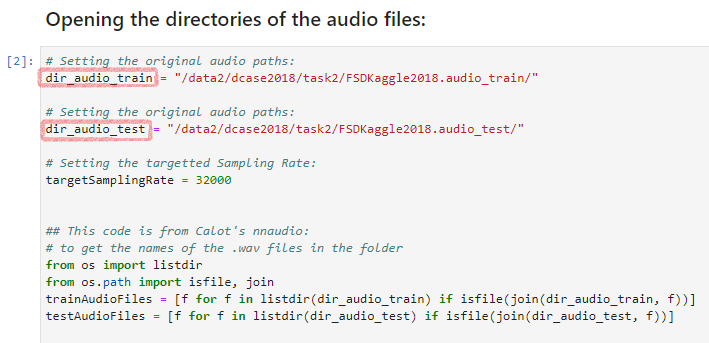
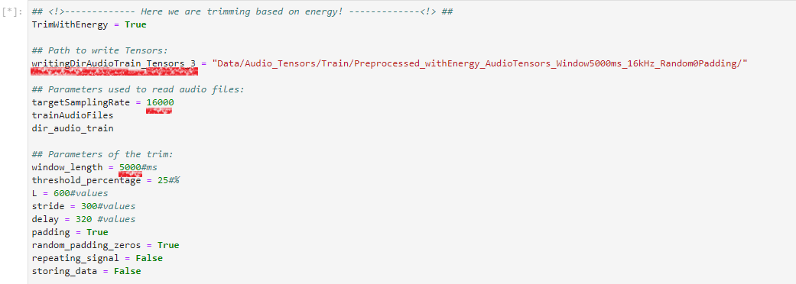

# SincNet v2.0 for DCASE:

This is the Version of `SincNet` with newer data loaders, training and testing functions.

It also has a modified version called `SincNet2D` that converts the ouput of of SincNet's bandpass filters to a **2D tensor**. This **2D tensor** is then subject to **2D CNN layers** (such as Conv2D, maxpooling2D and Batchnorm2D).



#### Table of Content

- [SincNet v2.0 for DCASE:](#sincnet-v20-for-dcase-)
  * [Prerequisites](#prerequisites)
  * [Conda Environment Setup](#conda-environment-setup)
    + [Bash Script Setup](#bash-script-setup)
    + [Dependency File Setup](#dependency-file-setup)
    + [Step by Step Guide](#step-by-step-guide)
  * [How to Setup SincNet for Experimentation:](#how-to-setup-sincnet-for-experimentation-)
    + [Fetch DCASE2018 Task2 Data](#fetch-dcase2018-task2-data)
      - [On Orange's Server](#on-orange-s-server)
      - [On Kaggle's Site](#On Kaggle's Site)
    + [Data Lists and Dicts Generation](#data-lists-and-dicts-generation)
    + [Preprocessing](#preprocessing)
      - [Python Preprocessing Script](#python-preprocessing-script)
      - [Notebook Preprocessing](#notebook-preprocessing)
        * [Training Set](#training-set)
        * [Testing Set](#testing-set)
    + [Setup the Configuration File](#setup-the-configuration-file)
    + [Training and Testing Models](#training-and-testing-models)
      - [Training a Model](#training-a-model)
      - [Testing a Model](#testing-a-model)
  * [Jupyter Notebooks](#jupyter-notebooks)
       * [Notebook Listing](#notebook-listing)
       * [Viewing Notebooks](#viewing-notebooks)
       * [Launching Notebooks](#launching-notebooks)
         + [Local Launch](#local-launch)
         + [Notebook Server](#notebook-server)
           - [Accessing the Notebook Server](#accessing-the-notebook-server)
  * [Utilities](#utilities)
       * [Path of the Previously Trained Models](#path-of-the-previously-trained-models)
    * [Results of the Previously Trained Models](#results-of-the-previously-trained-models)
    * [Tutors](#tutors)
    * [Author](#author)
    * [Co-Intern](#co-intern)

## Prerequisites

* Linux
* Miniconda or Anaconda **version (4.6+)**

## Conda Environment Setup

You can use one of the following to setup the conda environment:

* the `create_conda_environment.sh` provided script
* the dependency `.yml` file
* the step by step procedure below

### Bash Script Setup

`create_conda_environment.sh` has two options:

- `-n|--name` with this option you can overwrite the default environment names which is `SincNet`
- `-g|--gpu` if this option is set, the environment will contain a pytorch version with gpu support

To create the conda environment `SincNet`, with **gpu** support, run:

```bash
bash ./create_conda_environment.sh -g
```

> :warning: **Warnings**: :warning:
>
> * conda environment may not be activated after the execution of the script! 
>
> ​			&rarr; use `conda activate $envname` to do so. *(Remove `$envname` and replace it by the name of your environment. Default is `SincNet`.)*
>
> * To **activate conda**, we use a method that is compatible with the **versions (4.6+)** of conda. **If you have a lower version** please follow an other method or update conda.

### Dependency File Setup

`conda env create` has many options, but we will restrict ourselves to two of them:

- `-n|--name` with this option you can overwrite the default environment names which is `SincNet`
- `-f|--file` this option lets you specify the name of the dependency file you would like to use

To create the conda environment `SincNet`, with **gpu** support, run:

```bash
conda env create -f SincNet.yml
```

To create the conda environment `SincNet`, with **cpu** support, run:

``` bash
conda env create -f SincNet_CPU.yml
```

**Activate** the created conda environment

```bash
conda activate SincNet
```

> :warning: **Remark**: The `.yml` were generated by saving the original environment used to compile `SincNet`, thus it is safer to use. :warning:

### Step by Step Guide

If you do not use the setup script, you can create the environment with the following steps:

- Create the environment

```bash
conda create -n SincNet python=3.6.9 numpy=1.16.1
```

- Activate the created conda environment

```bash
conda activate SincNet
```

- Within conda environment, Install the libraries

```bash
conda install -y jupyter pandas matplotlib seaborn nbformat
conda install -y librosa prettytable jupyterlab pysoundfile tqdm jupyter_contrib_nbextensions -c conda-forge
```

* Within conda environment, pip Install those libraries too

  ```bash
  pip install nnaudio nbresuse torchsummary
  ```

Those packages are compatible with pytorch 1.1.0

- Install pytorch(within conda environment)

  - with gpu support:

  ```bash
  conda install pytorch==1.1.0 torchvision==0.3.0 -c pytorch
  pip install fastai
  ```
  - or **without** gpu support:

  ```bash
  conda install pytorch==1.1.0 torchvision==0.3.0 cpuonly -c pytorch
  ```

> :exclamation: Cpu only version **does not** support `fastai` :exclamation:

## How to Setup SincNet for Experimentation:

### Fetch DCASE2018 Task2 Data

You can either fetch the Data from Orange's server (**recommended**) or fetch it from kaggle directly.

#### On Orange's Server

The DCASE data already reviewed by Lionel is available at `/data2/dcase2018/task2/FSDKaggle2018.audio_train/` and `/data2/dcase2018/task2/FSDKaggle2018.audio_test/`on the server **yd-4q2twm2**.

You can store this data on your local machine anywhere as long as you save the path, you will need it for the next steps.

#### On Kaggle's Site

Follow the [link](https://www.kaggle.com/c/freesound-audio-tagging/data), register and download the data.

### Data Lists and Dicts Generation

In order to run **SincNet**, you must have `data_lists` containing the names of the audio files you wish to use for `training`, `validation` and `testing`. Same goes for the `lab_dicts`, you must save the **dictionaries of ground truths** for `training` *(includes the validation tensors)* and `testing` the models.

>  **:warning: Remarks​ :warning:**
>
>  If you are using **DCASE audios**; the data lists are already **available**. You can safely **skip this part** if you plan on using them.
>
>  If you are **not** using **DCASE audios**: you must generate your own data lists! Scripts provided might not work, they are specifically made for DCASE `CSVs` and may not be suitable for your data. 

1. `Generate_datalists.py` has 2 system arguments that **do not have default values**:
   1. The relative path to the txt file containing the audio names ***($TXT_PATH)***.  
   2. The category of the audios, must **contain strictly** one of these words: [`train`, `test`,  `valid`]. It is **not** case sensitive, `TrAiNing` will be recognized. ***($DATA_CATEGORY)***.  

``` bash
python Generate_datalists.py $TXT_PATH $DATA_CATEGORY
```

> ex: `python Generate_datalists.py data_lists/fold1_train.txt Train`


2. Generate_Groundtruths.py` has 2 system arguments that **do not have default values**:
   1. The relative path to the txt file containing the audio names ***($CSV_PATH)***.  
   2. The category of the audios, must **contain strictly** one of these words: [`train`, `test`]. It is **not** case sensitive, `TrAiNing` will be recognized. ***($DATA_CATEGORY)***.  

```bash
Generate_Groundtruths.py $CSV_PATH $DATA_CATEGORY
```

> ex: python Generate_Groundtruths.py data_lists/train.csv Train

### Preprocessing

The preprocessing is our way of extracting features from the audio files. Our script **normalizes** audio files then **removes** from the start and the end parts of the audio **that are inferior to a defined threshold** relative to the audio's **energy mean** (by default it is 25%). It also supports multiple **padding** methods for audio files incase they are below the required length **(wlen)**.

In our many tests, we used the preprocessing script with those values:

* **targetSamplingRate** = [16kHz, 32kHz]
* **window_length** = [1000ms, 4000ms, 4400ms, 5000ms]
* **delay, L, stride, random_padding_zeros, repeating signal,** etc... Were set after multiple test runs and were chosen based on their results. You can change them to your convenience, but keep in mind that you might not have the same results as we did...
* We tried several methods for padding:

  * **Default Padding**: Adding the same amount of zeros left and right in a deterministic way.
  * **repeating_signal**: Repeating the signal until desired length is reached.
  * **random_padding_zeros**: Adding a random number of zeros to the left and the remaining amount to the right.

 &rarr; **random_padding_zeros** gave us the best results, this is why we **recommend** using it.

> :warning: **Remarks**  :warning:
>
> We recommend that you set **preprocessing_wlen = input_wlen + 2x wshift + 1** in order to have multiple possibilities of reading for the same audio file. (`input_wlen` and `wshift` are the values you will set in the `.cfg` in order to train your network. They are respectively the **input size of your network** (Input Audio length in **ms**) and the **window shift** (Hop length) between each chunk of audio.)
>
> * Indeed it enables time shifting, our **DataSet loads a random chunk of the audio**. If the audio is exactly the size of the input required, it won't have much choice but to load the entire audio each time.
>
> * Moreover, the **DataSet loads differently data for validation and test**, it goes through the audio from the beginning to the end of the audio by loading a chunk of the **input size of your network** then after each successful loads, it shifts by `wshift` **(Time Shifting to the right)**. 
>
>   ​	&rarr;  Consequently, if you choose to set the **input size of your network to 800ms**, if you set **preprocessing_wlen to 1000ms**, you will have a minimum of 3 audio samples for each epoch of validation and/or test.  


You can either use the **python script** `preprocessing.py` to preprocess the audio files or the **notebook** `Pre-processing_audio_files_to_Tensors`. 

#### Python Preprocessing Script

`preprocessing.py` has 6 system arguments that **do not have default values**:

1. The absolute path to the train audio files ***($TRAIN_FOLDER)***.  
2. The absolute path to the test audio files ***($TEST_FOLDER)***.  
3. The relative path to save the preprocessed train audio files ***($OUTPUT_TRAIN_FOLDER)***.  
4. The relative path to save the preprocessed test audio files ***($OUTPUT_TEST_FOLDER)***.   
5. The window length **($wlen)** in ms.
6. The sampling rate of the preprocessing **($sr)** in hz.

To create the tensors for `SincNet`, replace the `$var` by the paths and run the following:

```bash
python preprocessing.py $TRAIN_FOLDER $TEST_FOLDER $OUTPUT_TRAIN_FOLDER $OUTPUT_TEST_FOLDER $wlen $sr 
```

> ex: `python preprocessing.py /data2/dcase2018/task2/FSDKaggle2018.audio_train/ /data2/dcase2018/task2/FSDKaggle2018.audio_test/ Data/test_train/ Data/test_test/ 1000 32000`

>  After execution, `preprocessing.py` will create a temporary directory where it will store the images of the first 10 audios. Before the end, it will remove the temporary directory and everything inside it.

#### Notebook Preprocessing

The preprocessing is done in the notebook `Pre-processing_audio_files_to_Tensors`. It must be placed at the same level as main.py, in the same directory as Images.

In this notebook, you should replace the values of the variables `dir_audio_train` and `dir_audio_test` with the paths of the Train and Test data that you fetched before hand. 



##### Training Set

Afterward, execute everything before **Preprocessing train audio on Energy** in the notebook. Then proceed to change the values of the variables and the folder's  location to your liking.



##### Testing Set

Just below the Training Set preprocessing you have the **Preprocessing test audio on Energy** section that does the same to the test dataset!

> :warning: **Remark**: We recommend having the same settings for testing and training data preprocessing. :warning:

### Setup the Configuration File

In SincNet, the configuration files are usually in the cfg directory, they are recognizable by their file format `.cfg`.

- Modify the *[data]* section of `cfg/test.cfg` file according to your paths. In particular, modify the **data_folder** with the location of the preprocessed data that you created following the tutorial above. The other parameters of the config file belong to the following sections:

1. *[windowing]*, that defines how each sentence is split into smaller chunks.
2. *[cnn]* or *[cnn2d]*, that specifies the characteristics of the CNN architecture. **(WARNING: you should not have both in one .cfg file.)**
   1. *[cnn]*, specifies the characteristics of a 1D convolutional layer.
   2. [cnn2d], specifies the characteristics of a 2D convolutional layer after SincConvfast (that is 1D).
3. *[dnn]*, that specifies the characteristics of the fully-connected DNN architecture following the CNN layers.
4. *[class]*, that specify the logsoftmax classification part.
5. *[optimization]*, that reports the main hyperparameters used to train the architecture.

* Once you setup the *config* file, you can attempt to train your model. See [Training and Testing Models.](#Training and Testing Models)

> :warning: **Remark:** You should change the `output_folder` in ***[data]*** it after each run!  :warning:

### Training and Testing Models

#### Training a Model

To train a model, you must run the python script `main.py`.

`main.py` has three options:

- `-cfg|--configPath` with this option, you indicate the path of the configuration file you would like to use

* `-fn|--FileName` if this option has a value set, the saved models will be named after this value
* `-tdp|--TestDataPath` if this option has a value set, the path of the saved test tensor files will be set after this value ***(usefull only for testing a model)***
* `-c|--cuda` if this option is set, the pytorch code will run with the Cuda device you specified. It defaults to -1, meaning that the CPU is chosen

To train a model with `test.cfg` on device `cuda:0`, execute the following command:

```bash
python main.py --configPath=cfg/test.cfg --cuda=0
```

#### Testing a Model

To test a model, you must run the python script `Test_Model.py`.

* `Test_Model.py` has the same options as `main.py`. ([See above](#Training a Model).)

* In `Test_Model.py`, in the section **Getting the data relevant to the test dataset**, you should modify the paths of `testTensorFiles`,  	`data_folder_test` and `lab_dict` according to the preprocessing you did in the [Testing Set](#Testing Set) section!

  * > :warning: **Remark**: If you are using DCASE data and you **did not** re-create your own datalists, you can use ours by keeping the values of `testTensorFiles` and `lab_dict` unchanged. :warning:

To test your previously trained model `test.cfg` on test data `insert_path_here` using the device `cuda:0`, execute the following command:

```bash
python Test_Model.py --configPath=cfg/test.cfg --TestDataPath=insert_path_here/ --cuda=0
```

## Jupyter Notebooks

**Why notebooks?**

`SincNet` gives you also the possibility to run experiments on `Jupyter Notebooks` and **analyze** their outcomes. It is easier to **plot** and **interact **with the results on `Jupyter Notebook`.

### Notebook Listing

Each Notebook is designed to accomplish a **task**, we will only list the ones that are **deemed useful** or **interesting**:

* `Compare_Changes_in_SincNet_Filters.ipynb`

  → **Reads models** from `.cfg` files

  → **Plots** `SincNet`'s filter banc `SincConv_fast` **before** and **after** training

  → **Quantifies** the Influence of learning bandpass filters on `SincNet`

  → **Analyzes** the behavior of `SincNet` without its filter banc `SincConv_fast`

  → **Compares ** the results between `regular SincNet`, `SincNet` without its filter banc `SincConv_fast` and `SincNet` with a frozen filter banc `SincConv_fast`

  → **Plots** the Fourier Transform of `SincNet1DConvsOnly` 1D convolutions

- `DCASE_SincNet_v2.0.ipynb`

  → **Reads models** from `.cfg` files

  → **Analyzes** `SincNet2D` Spectrograms

  → **Trains** loaded model

- `Pre-processing_audio_files_to_Tensors.ipynb`

  → **Loads audio** files from your **Data Base**

  → **Extract features** from the data (resamples, trims and normalizes data)

- `Net_Performance_Analysis.ipynb` and `Net2D_Performance_Analysis.ipynb`

  → **Loads results** of the previously trained models

  → **Plots** the results (may contain `confusion matrices` and `gradient monitoring`)

* `Evaluate_size_of_models.ipynb`

  → **Reads models** from `.cfg` files

  → **Counts** the number of parameters that **requires gradient** (learning)

### Viewing Notebooks

If you wish to **only view** them without running them or executing their cells, you can just simply double click on the `.html` files that are in the main directory.

### Launching Notebooks

This readme covers two way of launching the `Jupyter Notebooks`: 

* The **first** one is the easier but it requires you to have a local copy of `SincNet` on **your PC**. 
* The **second** method will guide you through creating a Notebook Server that will accessible to other PCs. It is useful if your copy of `SincNet` is on a **server** that is accessible by `ssh`.

#### Local Launch

In your local copy of `SincNet`, at the same level as `.git`, you can execute the following line after **installing** and **activating** your conda environment if you wish to view the notebooks:

```
jupyter lab
```

Double click on the `.ipynb` you desire to view and enjoy the reading experience!

#### Notebook Server

This configuration secures access to a notebook server and enables access from other computer. **This is not the multi-user server configuration.** It follows the guidelines that can be found [here](https://jupyter-notebook.readthedocs.io/en/stable/public_server.html).

- Create a Jupyter config file in your **home directory** if you do not already have one

  ```bash
  cd $HOME
  jupyter notebook --generate-config
  ```

- Create a password

  ```bash
  jupyter notebook password
  ```

- Create a certificate and the corresponding key

  ```bash
  openssl req -x509 -nodes -days 365 -newkey rsa:2048 -keyout mykey.key -out mycert.pem
  ```

- Modify the following lines in `$HOME/.jupyter/jupyter_notebook_config.py`

  ```python
  # Set options for certfile, ip, password, and toggle off
  # browser auto-opening
  c.NotebookApp.certfile = u'/absolute/path/to/your/certificate/fullchain.pem'
  c.NotebookApp.keyfile = u'/absolute/path/to/your/certificate/privkey.pem'
  
  # Set ip to '*' to bind on all interfaces (ips) for the public server
  c.NotebookApp.ip = '*'
  c.NotebookApp.open_browser = False
  ```

- Launch `jupyter lab` and it should be accessible from other computers now

  ```bash
  jupyter lab
  ```

##### Accessing the Notebook Server

1. If the **server** that you are connected to **is** on your Local Network, you can simply access it by putting the `url` `https://https://$Machine'sName.$DomainName:$PortNumber/:$PortNumber/`. Where **$Machine'sName** is the name of your server on the network and the **$PortNumber** is the port number that will be shown on your server's console. **(Default port number is 8888)**
2. If **server** that you are connected to **is not** on your Local Network but is accessible by a domain name, you can simply access it by putting the `url` `https://$Machine'sName.$DomainName:$PortNumber/`. Where **$Machine'sName** is the name of your server on the network, **$DomainName** is the domain name that gives you access to your server and the **$PortNumber** is the port number that will be shown on your server's console. **(Default port number is 8888)**

> ex: When I use **Orange's server** named **yd-4q2twm2**, I use this `url` to connect to the machine : https://yd-4q2twm2.rd.francetelecom.fr:8888/

Once you have access to your `Notebook Server` from your browser you are good to go! Double click on the `.ipynb` you desire to view and :cherry_blossom: enjoy the reading experience! :cherry_blossom:

:heavy_exclamation_mark: Important :heavy_exclamation_mark:

> **Use ‘https’.** Keep in mind that when you enable SSL support, you must access the notebook server over `https://`, not over plain `http://`!

## Utilities

##### Path of the Previously Trained Models

They are on the **yd-4q2twm2** server @ `/home/nlpt4239/SincNet_DCASE_v2.0/exp/`

##### Results of the Previously Trained Models

You can find the most relevant results of previously trained models [here](https://gitlab.tech.orange/golden-ear-for-things/nn-acoustic-feature-extraction/test).


##### Tutors

Lionel Delphin-Poulat [link](https://fr.linkedin.com/in/lionel-delphin-6a091a162)

Cyril Plapous [link.](https://fr.linkedin.com/in/cyril-plapous-983b04b1)

#####  Author

My name is Jean-Charles Layoun and I am the author of this document, if you want to contact me professionally please follow the [link.](https://fr.linkedin.com/in/jclayoun)

##### Co-Intern

 Paul Calot-Plaetevoet [link.](https://fr.linkedin.com/in/paul-calot-43549814b)